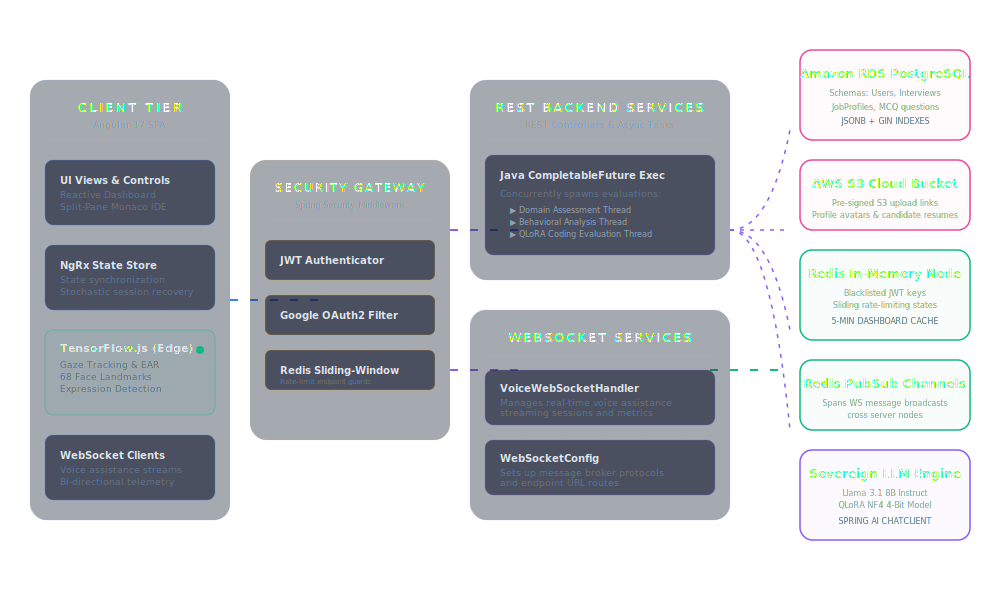
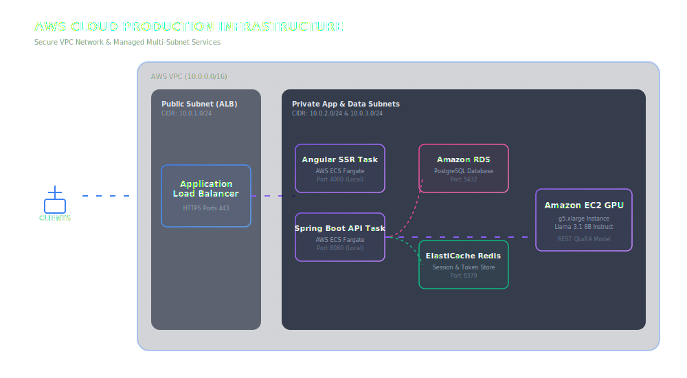
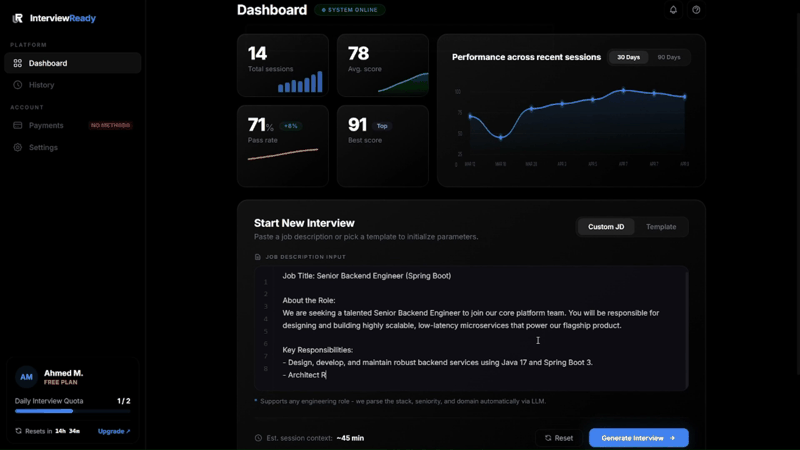

# InterviewReady — AI-Powered Technical Recruitment Platform

*The enterprise standard for automated, privacy-first technical screening and comprehensive candidate evaluation.*

---

## 1. Introduction

Traditional technical hiring platforms rely on static question banks that candidates memorize from leaked repositories, and invasive server-side video recording that raises serious biometric privacy concerns under regulations like GDPR.

**InterviewReady** is a production-ready, full-stack recruitment and evaluation platform that eliminates both problems. It dynamically generates role-specific assessments from raw job descriptions using a locally fine-tuned LLM, runs all proctoring and facial analysis directly inside the candidate's browser — with zero video uploads — and produces a comprehensive multi-axis intelligence report grading each candidate across five dimensions simultaneously.

---

## 2. Production Tools & Tech Stack

The system is built using a modern, scalable stack designed for high throughput and security:

* **Frontend Framework**: Angular 17 SPA with Standalone Components and Lazy Loading.
* **State Management**: NgRx Store (Redux pattern) for reactive state caching and session recovery.
* **Local Machine Learning**: TensorFlow.js running custom face landmark detection and attention models on the client's GPU.
* **Backend Framework**: Spring Boot 3 Core Engine with Spring Security web filters.
* **Caching & Session Cache**: Redis Cache for JWT blacklists, sliding-window rate limiting, and performance metric caches.
* **Relational Storage**: PostgreSQL with hybrid structured schemas, optimized indexes, and GIN indices on JSONB reports.
* **AI Evaluation Engine**: Sovereign Llama 3.1 8B Instruct model fine-tuned using QLoRA.

---

## 3. What Sets InterviewReady Apart

| Capability | Traditional Platforms | InterviewReady |
| :--- | :--- | :--- |
| **Question Generation** | Static database (prone to leaks) | Dynamically synthesized from job descriptions via fine-tuned LLM |
| **Proctoring & Privacy** | Raw video uploaded to cloud servers | All CV models run locally in-browser via TensorFlow.js — zero biometric data leaves the device |
| **Evaluation Depth** | Single-axis (unit test pass/fail) | 5-axis profiling: logic, domain knowledge, behavioral composure, session integrity, time management |
| **Session Resilience** | Progress lost on crash or disconnect | Full state recovery via NgRx store synchronization |

---

## 4. System Architecture

The platform follows a layered architecture spanning four tiers:

**Client Tier (Angular 17 SPA)** — Standalone component routing, reactive NgRx state management, Monaco-based code editor, and an edge computer vision pipeline running three TensorFlow.js models (face detection, landmark extraction, expression classification) at 5 FPS entirely inside the browser.

**Security Gateway (Spring Security)** — Stateless JWT authentication with custom filters, Google OAuth2 integration, and Redis-backed sliding-window rate limiting to prevent brute-force attacks.

**Service Tier (Spring Boot 3)** — RESTful API controllers, WebSocket handlers for real-time voice telemetry, and an asynchronous grading pipeline using Java CompletableFuture to evaluate code quality, domain knowledge, and behavioral composure in parallel — achieving a 1.88x speedup over sequential execution.

**Persistence & AI Layer** — Amazon RDS PostgreSQL with JSONB columns and GIN indexes for flexible report querying, Redis for JWT blacklisting and dashboard caching, S3 for file storage, and a sovereign Llama 3.1 8B Instruct model fine-tuned with QLoRA running on a private GPU instance.

### Architecture Diagrams

#### Layered System Architecture

#### AWS Deployment Architecture

---

## 5. Platform Demo Walkthrough

An animated recording showing the full candidate journey — from entering custom job description requirements, navigating MCQ proctoring panels, coding algorithmic solutions in the IDE with active eye/gaze tracking alerts, and compiling the finalized 16-chart intelligence report scorecard.

---

## 6. The 16-Chart Candidate Evaluation Dashboard

Upon completing an assessment, the system generates a comprehensive intelligence report containing **16 analytical charts** that profile the candidate across technical, behavioral, and integrity dimensions:

| # | Chart | Description |
|---|-------|-------------|
| 1 | **Overall Performance Score** | Weighted donut chart showing the candidate's normalized final score |
| 2 | **Response Time per Question** | Time spent per question benchmarked against expected difficulty-calibrated averages |
| 3 | **Behavioral Composure Timeline** | Emotional trajectory over the session (Neutral, Confident, Anxious, Surprised) |
| 4 | **Gaze & Eye Tracker Profile** | Distribution of gaze direction: Center, Left, Right, Up, Down |
| 5 | **Correctness Heatmap** | Color-coded grid of MCQ and coding answer correctness |
| 6 | **Code Quality Radar** | 7-axis radar: Modularity, Time Complexity, Space Complexity, Correctness, Syntax, Edge Cases, Naming |
| 7 | **Category Score Breakdown** | Performance across engineering competencies (OOP, SQL, System Design, etc.) |
| 8 | **Confidence Level Distribution** | Segmented classification: Guessing, Hesitant, Moderate, High Confidence |
| 9 | **Proctoring Event Aggregations** | Counts of tab switches, face losses, camera blocks, copy-paste attempts |
| 10 | **Head Stability Index** | Variance in Yaw, Pitch, and Roll angles to detect erratic movement |
| 11 | **Topic-Specific Performance Matrix** | Granular accuracy mapped to individual syllabus topics |
| 12 | **Difficulty Level Analysis** | Grouped success rates across Easy, Medium, and Hard problems |
| 13 | **Response Time Distribution** | Histogram comparing candidate pacing against population curves |
| 14 | **Stress-Emotion Accuracy Correlator** | Facial expression stress mapped against answer correctness per question |
| 15 | **Proctoring Timeline Logs** | Chronological audit trail of all integrity alerts with timestamps |
| 16 | **Navigation Pattern Graph** | Candidate flow visualization: skipping, backtracking, and review loops |

---

## 7. Technical Specifications

| Component | Details |
|-----------|---------|
| **LLM Engine** | Llama 3.1 8B Instruct · 4-bit NF4 quantization · QLoRA (Rank 16, Alpha 32, rsLoRA) |
| **Training** | 2,700-sample custom dataset · 150 LeetCode problems · 6 variation archetypes · 3 languages |
| **Evaluation** | 0.90 Cosine Similarity · 0.89 BERTScore F1 against expert human evaluations |
| **Database Indexing** | B-Tree on primary keys · Composite B-Tree on dashboard lookups · GIN on JSONB report columns |
| **Rate Limiting** | Redis sliding-window: 5 login attempts / 60s, 3 registration attempts / 60s |
| **Parallel Execution** | Java CompletableFuture thread pool · 1.88x speedup over sequential report assembly |

---

## 8. License

This project is licensed under the [MIT License](LICENSE) - see the [LICENSE](LICENSE) file for details.

---

Made with ❤️ by <a href="https://github.com/MoamenAbdelrazik">Moamen Abdelrazik</a>

